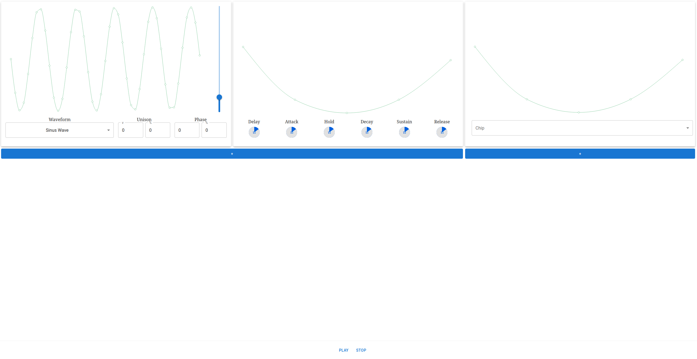

This repository was created only for my education (personal, not school). I wanted to learn how synths are made. At the same time I didnt want to learn all of the tools typically used for developing these softwares. I dicided to do small synth with React which I already knew. The goal was not to create actual product but me getting general idea of what sytnths are and how they are made. For these reasons I think this stack is justified. At the moment this repository is on hold since I have more important things I do but whenever I want to gain new portion of information I will get back to it to do a little learning and write some code.

Things to do:

-   [ ] UNISON
-   [ ] PHASE
-   [ ] implement ENV (with hardcoded wave)
-   [ ] Deley
-   [ ] Attack
-   [ ] Hold
-   [ ] Decay
-   [ ] Sustain
-   [ ] Release
-   [ ] implement LFO (with hardcoded wave) + enable disable
-   [ ] keyuboard and midi inputs???
